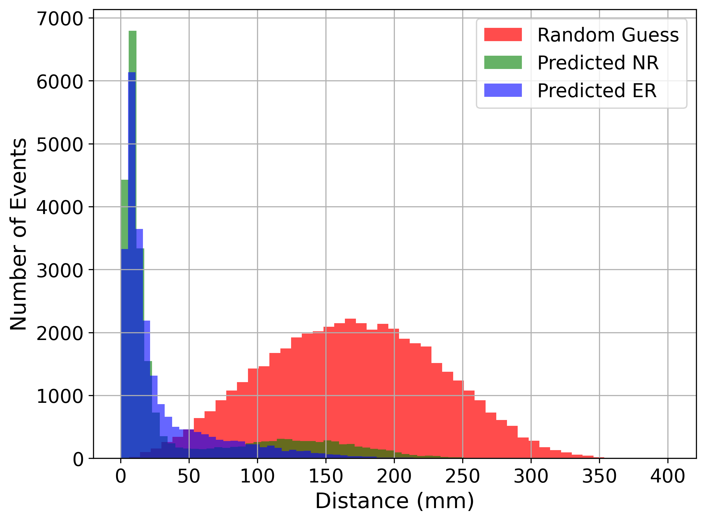
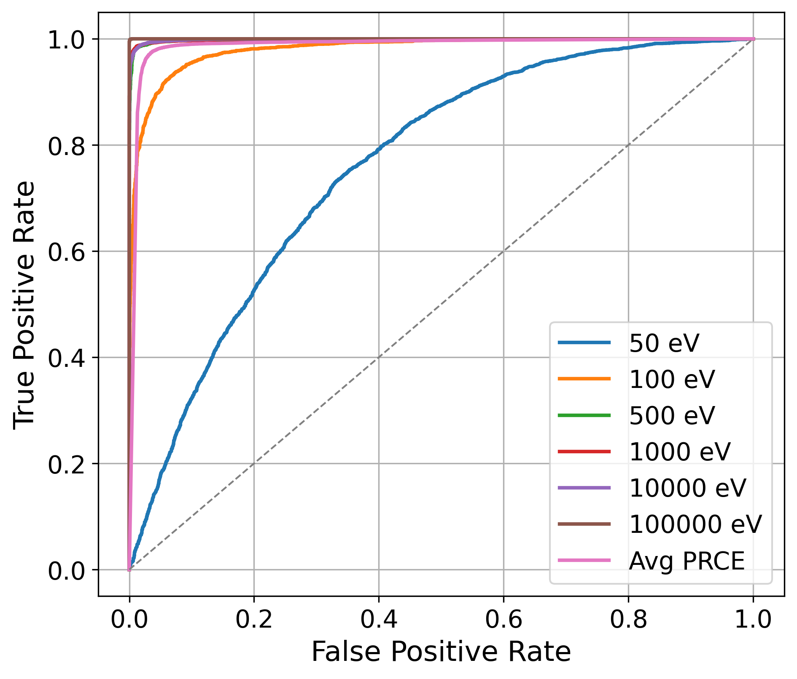
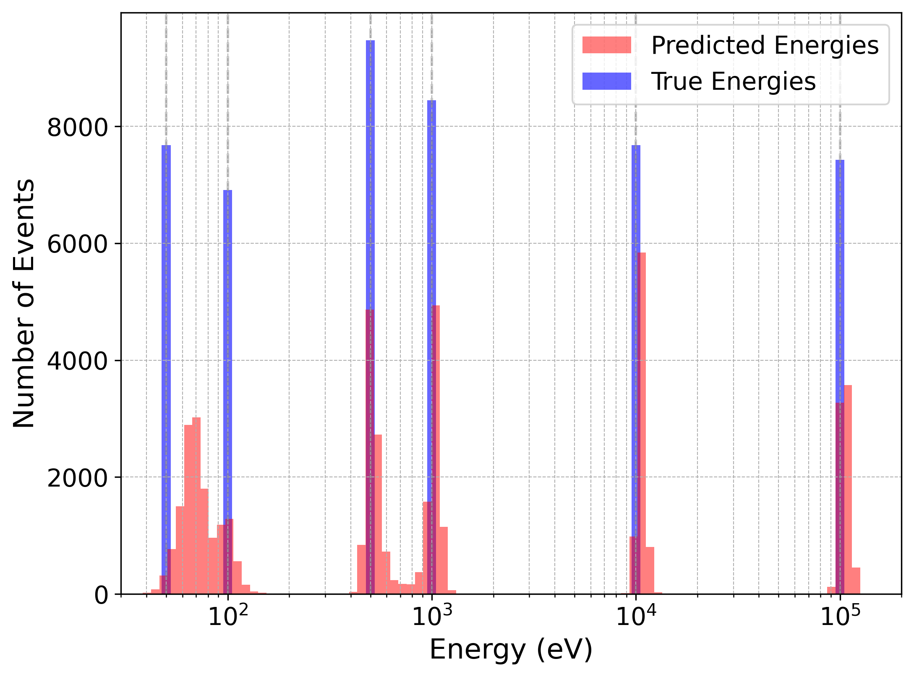

## Overview
This repository contains the code developed for my MSci thesis at Imperial College London. It implements a hybrid LSTM–Transformer architecture to process time-series data from particle detectors and jointly perform:

- **Event classification**
- **Energy regression**
- **3D spatial reconstruction**

Hence the PRCE name - Position Reconstruction, Classification and Energy regression.
The model was trained and evaluated on simulated detector data, with a focus on performance under noise and generalization across event types.

## Key Results

- **Position Reconstruction**: Achieved sub-centimetre accuracy (e.g. 4.98 mm MED for 100 keV events). Maintained ~6 mm accuracy across high energies under noise.
- **Classification (ER vs NR)**: ROC-AUC ≥ 0.999 at most energies under noisy conditions (PRC). PRCE model showed strong robustness with AUC ≥ 0.987.
- **Energy Regression**: Bias < 6.5% (i.e. high accuracy) and Resolution < 5.5% (i.e. high precision) at 10-100 keV with noise. Maintained ~11% average bias and resolution across all energies.
- **Multi-Task Architecture**: PRCE model demonstrated improved noise robustness across tasks, benefiting from joint training on classification, regression, and reconstruction.

For classification, the performance of the PRCE model was compared to an earlier version of the model called the PRC model, which only performed position reconstruction and classification.

# Position Reconstruction Histogram Plot (Predicted vs Random Guess)

# ROC Curve on Noised Data (PRC model vs PRCE model)

# Energy Histogram Plot (PRCE model)

## How to Run

You’ll need:
- Python 3.10+
- PyTorch
- NumPy, SciPy, Matplotlib

To use:
1) Have prcemodel.py and prcetrain.py in the same directory.
2) Modify the CONFIG part in prcetrain.py with the desired parameters and file paths.
   Note: Epoch number needs to be 1 more than what you actually need.
3) Run using the following command: python3 train.py (Note that it is designed for use in a Unix-based GPU cluster i.e. uses bash file paths)

